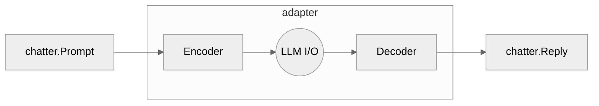

<p align="center">
  <h3 align="center">chatter</h3>
  <p align="center"><strong>a universal toolkit for working with LLMs</strong></p>

  <p align="center">
    <!-- Build Status  -->
    <a href="https://github.com/kshard/chatter/actions/">
      
    </a>
    <!-- GitHub -->
    <a href="https://github.com/kshard/chatter">
      
    </a>
    <!-- Coverage -->
    <a href="https://coveralls.io/github/kshard/chatter?branch=main">
      
    </a>
    <!-- Go Card -->
    <a href="https://goreportcard.com/report/github.com/kshard/chatter">
      
    </a>
  </p>

  <table align="center">
    <thead><tr><th>sub-module</th><th>doc</th><th>about</th></tr></thead>
    <tbody>
    <!-- Module chatter types -->
    <tr><td><a href=".">
      
    </a></td>
    <td><a href="https://pkg.go.dev/github.com/kshard/chatter">
      
    </a></td>
    <td>
      Core types and helper utilities
    </td></tr>
    <!-- Provider bedrock -->
    <tr><td><a href=".">
      
    </a></td>
    <td><a href="https://pkg.go.dev/github.com/kshard/chatter/provider/bedrock">
      
    </a></td>
    <td>
      AWS Bedrock AI models
    </td></tr>
    <!-- Module bedrock batch 
    <tr><td><a href=".">
      
    </a></td>
    <td><a href="https://pkg.go.dev/github.com/kshard/chatter/llm/bedrockbatch">
      
    </a></td>
    <td>
      AWS Bedrock Batch Inference
    </td></tr>
    -->
		<!-- Provider openai -->
    <tr><td><a href=".">
      
    </a></td>
    <td><a href="https://pkg.go.dev/github.com/kshard/chatter/provider/openai">
      
    </a></td>
    <td>
      OpenAI models (+ compatible API)
    </td></tr>
		</tbody>
	</table>
</p>

---

> Abstract LLMs. Switch backends. Stay consistent. 

Large Language Models (LLMs) APIs are clunky and tightly coupled to specific provider. There are no consistent and extensible interface that works with all models.

`chatter` is an adapter that integrates with popular Large Language Models (LLMs) and hosting solutions under umbrella of a unified interface.  Portability is the primary problem addressed by this library.


## Quick Start

```go
package main

import (
  "context"
  "fmt"

  "github.com/kshard/chatter"
  "github.com/kshard/chatter/provider/openai/llm/gpt"
)

func main() {
  llm := gpt.Must(gpt.New("gpt-4o",
    openai.WithSecret("sk-your-access-key"),
  ))

  reply, err := llm.Prompt(context.Background(),
    []chatter.Message{
      chatter.Text("Enumerate rainbow colors.")
    },
  )
  if err != nil {
    panic(err)
  }

  fmt.Printf("==> (%+v)\n%s\n", llm.Usage(), reply)
}
```

## What is the library about?

From application perspective, Large Language Models (LLMs) are non-deterministic functions `ƒ: Prompt ⟼ Output`, which generate output based on input prompt. Originally, LLMs were created as human-centric assistants for working with unstructured text.

Recently, they have evolved to support rich content (images, video, audio) and, more importantly, to enable machine-to-machine interaction — for example in RAG pipelines and agent systems. These use cases require more structured formats for both prompts and outputs.

However, the fast-moving AI landscape created fragmented ecosystem: OpenAI, Anthropic, Meta, Google and others — each providing models with different APIs and formats, often incompatible. This makes integration and switching between providers difficult in real applications.

This library (`chatter`) introduces a high-level abstraction over non-deterministic LLM functions to standardize access to popular models in Go (Golang). It allows developers to switch providers, run A/B testing, or refactor pipelines with minimal changes to application code.

The library abstracts LLMs as an I/O protocol, with a prompt Encoder and a reply Decoder. This way, implementing a new provider becomes a mechanical task — just following the specification.



To be fair, AWS Bedrock Converse API is the first semi-standardized effort to unify access to multiple LLMs. But it only works inside AWS ecosystem. You cannot combine models from OpenAI, Google, and others easily.

This library provides that missing flexibility.

Please note, this library is not about Agents, RAGs, or similar high-level concepts. It is a pure low-level interface to use LLMs as non-deterministic functions.


## Getting Started

The latest version of the library is available at `main` branch of this repository. All development, including new features and bug fixes, take place on the `main` branch using forking and pull requests as described in contribution guidelines. The stable version is available via Golang modules.

The library is organized into multiple submodules for better dependency control and natural development process.

Core data types are defined in the root module: `github.com/kshard/chatter`. This module defines how prompts are structured and how results are passed back to the application.

All LLM adapters are following the structure:
```go
import "github.com/kshard/chatter/{provider}/{capability}/{family}"
```

For a list of supported `provider`, see the [provider](./provider/) folder.

Each provider module encapsulates access to various **capabilities** — distinct categories of AI services such as:
* `embedding` — vector embedding service, which transforms text into numerical representations for search, clustering, or similarity tasks.
* `foundation` — interface for general-purpose large language model capabilities, including chat and text completion.

Within each capability, implementations are further organized by **model families**, which group related models API characteristics. 

Thus, the overall module hierarchy reflects this layered design:

```
provider/           # AI service provider (e.g., openai, mistral)
  ├─ capability/    # Service category (e.g., embedding, llm)
  │    └─ family/   # Model family (e.g., gpt, claude, text2vec)
```

For example:
* `github.com/kshard/chatter/bedrock/llm/converse` implements [AWS Bedrock Converse API](https://docs.aws.amazon.com/bedrock/latest/APIReference/API_runtime_Converse.html) 
* `github.com/kshard/chatter/openai/llm/gpt` implements [OpenAI Chat Completition](https://platform.openai.com/docs/api-reference/chat) for GPT models

In addition to model adapters, the library includes composable utilities (in `github.com/kshard/chatter/aio`) for common tasks like caching, rate limiting, and more - helping to build efficient and scalable AI applications.


### LLM I/O

`Chatter` is the main interface for interacting with all supported models. It takes a list of messages representing the conversation history and returns the LLM's reply.

Both `Message` and `Reply` are built from `Content` blocks — this allows flexible structure for text, images, or other modalities.

```go
type Chatter interface {
	Usage() Usage
	Prompt(context.Context, []chatter.Message, ...chatter.Opt) (*chatter.Reply, error)
}
```

### Prompt 

> A good prompt has 4 key elements: Role, Task, Requirements, Instructions.
["Are You AI Ready? Investigating AI Tools in Higher Education – Student Guide"](https://ucddublin.pressbooks.pub/StudentResourcev1_od/chapter/the-structure-of-a-good-prompt/)

In the research community, there was an attempt for making [standardized taxonomy of prompts](https://aclanthology.org/2023.findings-emnlp.946.pdf) for large language models (LLMs) to solve complex tasks. It encourages the community to adopt the TELeR taxonomy to achieve meaningful comparisons among LLMs, facilitating more accurate conclusions and helping the community achieve consensus on state-of-the-art LLM performance more efficiently.

Package `chatter` provides utilities for creating and managing structured prompts for language models.

The Prompt type allows you to create a structured prompt with various sections such as **task**, **rules**, **feedback**, **examples**, **context**, and **input**. This helps in maintaining semi-structured prompts while enabling efficient serialization into textual prompts.

```
{task}. {guidelines}.
1. {requirements}
2. {requirements}
3. ...
{feedback}
{examples}
{context}
{context}
...
{input}
```

Example usage:

```go
var prompt chatter.Prompt{}

prompt.WithTask("Translate the following text")

// Creates a guide section with the given note and text.
// It is complementary paragraph to the task.
prompt.WithGuide("Please translate the text accurately")

// Creates a rules / requirements section with the given note and text.
prompt.WithRules(
  "Strictly adhere to the following requirements when generating a response.",
  "Do not use any slang or informal language",
  "Do not invent new, unkown words",
)

// Creates a feedback section with the given note and text.
prompt.WithFeedback(
  "Improve the response based on feedback",
  "Previous translations were too literal.",
)

// Create example of input and expected output.
prompt.WithExample(`["Hello"]`, `["Hola"]`)

// Creates a context section with the given note and text.
prompt.WithContext(
  "Below are additional context relevant to your goal task.",
  "The text is a formal letter",
)

// Creates an input section with the given note and text.
prompt.WithInput(
  "Translate the following sentence",
  "Hello, how are you?",
)
```

### Reply

TBD.


## Advanced Usage


### Autoconfig: Model Initialization from External Configuration

This library includes an `autoconfig` provider that offers a simple interface for creating models from external configuration. It is particularly useful when developing command-line applications or scripts where hardcoding model details is undesirable.

By default, `autoconfig` reads configuration from your `~/.netrc` file, allowing you to specify the provider, model, and any provider- or model-specific options in a centralized, reusable way.

```go
import (
	"github.com/kshard/chatter/provider/autoconfig"
)

model, err := autoconfig.FromNetRC("myservice")
```

#### `.netrc` Format

Your `~/.netrc` file must include at least the `provider` and `model` fields under a named service entry. For example:

```
machine myservice
  provider provider:bedrock/foundation/converse
  model us.anthropic.claude-3-7-sonnet-20250219-v1:0
```

* `provider` specifies the full path to the provider's capability (e.g., `provider:bedrock/foundation/converse`). The path ressembles import path of providers implemented by this library
* `model` specifies the exact model name as recognized by the provider


Each provider and model family may support additional options. These can also be added under the same `machine` entry and will be passed into the corresponding provider implementation.

```
region     // used by Bedrock providers
host       // used by OpenAI providers
secret     // used by OpenAI providers
timeout    // used by OpenAI providers
dimensions // used by embedding families
```

### LM Studio

The `openai` provider supports any service with OpenAI compatible API, for example LM Studio. You need to set the model host address manually in configuration.

```go
import (
	"github.com/kshard/chatter/provider/openai/llm/gpt"
)

assistant, err := gpt.New("gemma-3-27b-it", 
  openai.WithHost("http://localhost:1234"),
)
```

### AWS Bedrock Inference Profile

See the [explanation about usage of models with inference profile](https://repost.aws/questions/QUEU82wbYVQk2oU4eNwyiong/bedrock-api-invocation-error-on-demand-throughput-isn-s-supported)

```go
import (
	"github.com/kshard/chatter/provider/bedrock/llm/converse"
)

converse.New("us.anthropic.claude-3-7-sonnet-20250219-v1:0")
```

## How To Contribute

The library is [MIT](LICENSE) licensed and accepts contributions via GitHub pull requests:

1. Fork it
2. Create your feature branch (`git checkout -b my-new-feature`)
3. Commit your changes (`git commit -am 'Added some feature'`)
4. Push to the branch (`git push origin my-new-feature`)
5. Create new Pull Request

The build and testing process requires [Go](https://golang.org) version 1.23 or later.

**build** and **test** library.

```bash
git clone https://github.com/kshard/chatter
cd chatter
go test ./...
```

### API documentation
* [AWS Bedrock API Params & Models](https://docs.aws.amazon.com/bedrock/latest/userguide/model-parameters.html)
* [AWS Bedrock Foundation Models](https://docs.aws.amazon.com/bedrock/latest/userguide/models-supported.html)

### commit message

The commit message helps us to write a good release note, speed-up review process. The message should address two question what changed and why. The project follows the template defined by chapter [Contributing to a Project](http://git-scm.com/book/ch5-2.html) of Git book.

### bugs

If you experience any issues with the library, please let us know via [GitHub issues](https://github.com/kshard/chatter/issue). We appreciate detailed and accurate reports that help us to identity and replicate the issue. 


## License

[](LICENSE)


## Reference
1. [Use a tool to complete an Amazon Bedrock model response](https://docs.aws.amazon.com/bedrock/latest/userguide/tool-use.html)
2. [Converse API tool use examples](https://docs.aws.amazon.com/bedrock/latest/userguide/tool-use-examples.html)
3. [Call a tool with the Converse API](https://docs.aws.amazon.com/bedrock/latest/userguide/tool-use-inference-call.html)
  